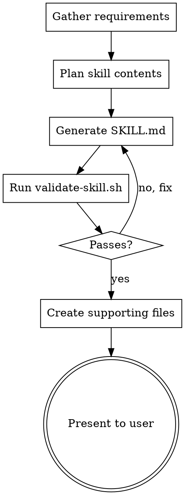

# Creating Skills

Generate high-quality, predictable `.agent/skills/` directories from user requirements.

## When to Use

- User asks to create, build, or scaffold a new skill
- User wants to extend agent capabilities with specialized workflows
- User mentions SKILL.md, skill templates, or skill authoring
- User wants to package domain knowledge, scripts, or references as a reusable skill

## Workflow

Copy this checklist and track progress with TodoWrite when available; otherwise keep the checklist updated manually in your response:

```
Skill Creation Progress:
- [ ] Gather requirements (purpose, triggers, domain knowledge)
- [ ] Plan structure (scripts? references? assets?)
- [ ] Generate SKILL.md with valid frontmatter
- [ ] Create supporting files (scripts/, resources/, examples/)
- [ ] Validate with scripts/validate-skill.sh
- [ ] Present final structure to user
```

### Plan-Validate-Execute Loop



## Instructions

### 1. Folder Hierarchy

Every skill follows this structure (only SKILL.md is required):

```
skill-name/
├── SKILL.md          # Main logic and instructions
├── scripts/          # Helper scripts (optional)
├── examples/         # Reference implementations (optional)
└── resources/        # Templates or assets (optional)
```

### 2. YAML Frontmatter Rules

| Field | Constraints |
|-------|-------------|
| `name` | Prefer gerund form for action skills (`testing-code`, `managing-databases`). Descriptive noun form acceptable for reference/knowledge skills (`reloading-domain-knowledge`, `unity-project-conventions`). Max 64 chars. Lowercase, digits, hyphens only. No "claude" or "anthropic". |
| `description` | Third person. Include specific triggers/keywords. Max 1024 chars. Start with what the skill does, then "Use when..." triggers. |

```yaml
# GOOD — action skill (gerund)
---
name: processing-pdfs
description: Extracts text and tables from PDF files. Use when the user mentions document processing, PDF files, or text extraction from documents.
---

# GOOD — reference/knowledge skill (descriptive)
---
name: reloading-domain-knowledge
description: Provides real-world ammunition reloading reference knowledge. Use when implementing reloading mechanics, ballistics calculations, or debugging reloading-related game logic.
---

# BAD - first person, no triggers
---
name: pdf-helper
description: I help you work with PDFs
---
```

### 3. Writing the Body

**Assume the agent is smart.** Do not explain common concepts. Focus only on the unique logic of the skill.

**Degrees of Freedom:**

| Freedom | Format | When |
|---------|--------|------|
| High | Bullet points | Heuristics, multiple valid approaches |
| Medium | Code blocks / templates | Preferred pattern with some variation |
| Low | Specific bash commands | Fragile operations, exact sequence required |

**Structural rules:**
- Keep SKILL.md under 500 lines for action/workflow skills. Reference/knowledge skills with lookup tables, formulas, or domain data may exceed this up to 700 lines — but prefer extracting large data tables into `resources/` files.
- Use `/` for all paths, never `\`
- Link from `SKILL.md` directly to supporting files only (one level deep). Do not create link-chains where a referenced file primarily links to more references.
- Use imperative/infinitive form ("Extract text", not "Extracting text" or "You should extract")

### 4. Workflow & Feedback Loops

For complex skills, include these patterns:

**Checklists** — trackable state the agent can copy and update:

```markdown
## Task Progress
- [ ] Analyze input
- [ ] Generate output
- [ ] Validate result
```

**Validation loops** — Plan-Validate-Execute before destructive operations:

```markdown
1. Run `python scripts/check_config.py input.json`
2. If validation passes, proceed to step 3
3. Apply changes with `python scripts/apply.py input.json`
```

**Error handling** — treat scripts as black boxes:

```markdown
Run `scripts/helper.sh --help` if unsure about flags or usage.
```

### 5. Output Format

When generating a skill, produce output in this structure:

```markdown
### [Folder Name]
**Path:** `.agent/skills/[skill-name]/`

### SKILL.md
(full contents with frontmatter)

### Supporting Files
(scripts/, resources/, examples/ contents if applicable)
```

### 6. Anti-Patterns

| Avoid | Why |
|-------|-----|
| Verbose explanations of common concepts | Agent already knows; wastes context |
| Multiple language examples for same pattern | One excellent example beats many mediocre ones |
| Deeply nested references (file links file) | Keep references one level deep from SKILL.md |
| Narrative storytelling ("In session X, we found...") | Not reusable; focus on the pattern |
| Generic names (`helper`, `utils`, `tools`) | Name by action: `processing-pdfs`, `validating-configs` |
| Windows paths (`scripts\helper.py`) | Always use forward slashes |
| Time-sensitive instructions | Use "current" vs "deprecated" sections instead |

### 7. Validation

After generating any skill, run the validation script:

```bash
bash .agent/skills/creating-skills/scripts/validate-skill.sh path/to/skill-folder
```

Run `scripts/validate-skill.sh --help` for details. The validation script treats 500 lines as a warning (not failure) for reference/knowledge skills; 700 lines is the hard limit.

## Quick Reference

| Aspect | Requirement |
|--------|-------------|
| Required file | `SKILL.md` with YAML frontmatter |
| Name format | Gerund (action) or descriptive (reference), lowercase, hyphens, max 64 chars |
| Description | 3rd person, includes triggers, max 1024 chars |
| Body length | Under 500 lines (action), up to 700 (reference/knowledge) |
| Path separators | Forward slashes only |
| References | One level deep from SKILL.md |
| Freedom matching | Bullets (high) / Code (medium) / Commands (low) |

## Resources

- Scaffold template: `resources/skill-template.md`
- Validation script: `scripts/validate-skill.sh`
- Example skill: `examples/deployment-guard/`
