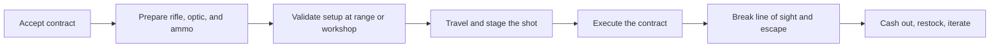
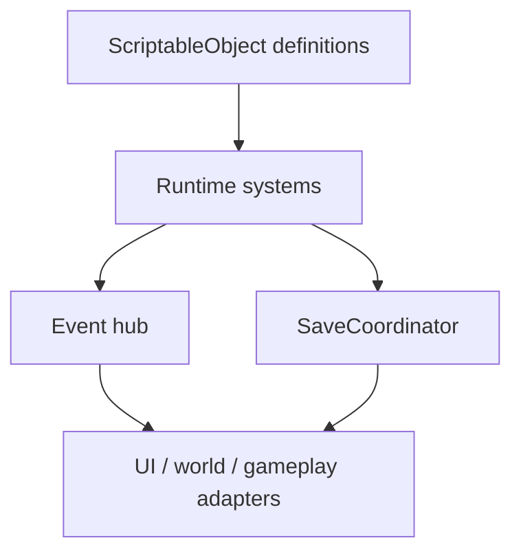

# Reloader

**Reloader** is a first-person precision-assassination sandbox built in Unity.

The core fantasy is simple: accept a contract, prepare the rifle, build or choose the right ammunition, validate your setup, make a difficult long-range shot, and escape the consequences. I am building it because this is the game I genuinely want to play: a sandbox with cool sniper rifles, meaningful long-range shooting, and enough simulation depth that hitting at distance feels earned rather than automated.

## Highlights

- Dream-game project focused on long-range shooting, sniper rifles, and sandbox consequence
- Unity `6000.3.8f1` vertical slice with modular gameplay domains under `Assets/_Project`
- Data-driven architecture using ScriptableObjects, runtime instances, event ports, and versioned save modules
- Strong verification culture with module-scoped asmdefs plus broad EditMode and PlayMode coverage
- Docs-first solo development process with explicit implemented-vs-planned status tracking

## Media

This README is structured to support screenshots and short gameplay GIFs cleanly.

- Hero clip: contract acceptance -> rifle prep -> long-range shot
- Systems clip: reloading bench / optics / range validation
- Sandbox clip: world traversal, target setup, escape flow

If you are reviewing the project before media is added, the best overview is the player loop diagram, the architecture section, and the `v0.1` status section below.

## What It Is

Reloader is aimed at the space between:

- sandbox simulation
- long-range shooting
- weapon preparation and reloading
- consequence-driven mission design

It is not designed as a hand-holding shooter. The goal is to make player skill, preparation, and decision-making matter.

## Why I Built It

This project comes from a very direct place: I love long-range shooting, sandboxes, and well-designed sniper rifles, and I wanted a game that takes those interests seriously.

Most games let the rifle fantasy do the work for the player. I want the opposite. I want a shot at distance to mean something. That means the game has to care about setup, optics, ammo, position, and follow-through. It also means the surrounding sandbox has to react when the player gets it right or gets it wrong.

Reloader is my attempt to build that game with both strong player fantasy and solid engineering underneath it.

## Core Player Loop



The economy and progression spine is built around assassination contracts, not generic open-world filler. The surrounding systems exist to support that loop.

## Core Features

### Gameplay

- First-person singleplayer sandbox focused on long-range shooting
- Procedural assassination-contract framework as the main progression driver
- Weapon preparation loop built around optics, ammo, and shot setup
- Optional validation flow at the range before taking real shots
- Police heat / escape pressure as a consequence layer around the contract loop

### Simulation / Systems

- Data-driven weapon, ammo, and equipment definitions
- Runtime item instances that support persistent physical state
- Ballistics-first design where long-range outcomes are influenced by setup quality
- Reloading systems intended to make ammo quality part of real gameplay, not just menu flavor
- Modular architecture intended to support adding new content without rewriting core systems

### Current v0.1 Slice

Implemented in the repo today:

- FPS controller foundation
- single-stage press interaction
- `.308 Winchester` content slice
- magnified scope runtime
- basic projectile drop ballistics
- range validation and group-size feedback
- basic inventory and item persistence
- shop flow
- NPC dialogue foundation

In progress:

- full procedural contract loop hardening
- MainTown as the main authored contract hub
- police response / escape loop
- broader save/load restoration coverage
- stronger link between ammo quality and long-range success

## Technical Approach

This project is intentionally structured as a modular vertical-slice sandbox rather than a loose collection of Unity scenes and scripts.

### Architecture

- Feature-first module layout under `Reloader/Assets/_Project/`
- ScriptableObject definitions for authored content
- runtime instance classes for live item state
- bounded cross-domain communication through `IGameEventsRuntimeHub`
- versioned save/load orchestration through `SaveCoordinator`
- separate assembly definitions per domain
- broad EditMode and PlayMode coverage across gameplay systems



### Repo Organization

The custom project code lives primarily in:

```text
Reloader/Assets/_Project/
  Core/
  Player/
  Weapons/
  Reloading/
  Inventory/
  Economy/
  Contracts/
  World/
  NPCs/
  LawEnforcement/
  Vehicles/
  UI/
  Audio/
```

Supporting docs live in `docs/design/`, with:

- `docs/design/core-architecture.md` as the main architecture reference
- `docs/design/v0.1-demo-status-and-milestones.md` as the current implemented-vs-planned status board
- `docs/design/README.md` as the routing index for the design docs

This matters for portfolio review because the repo is meant to show both the game idea and the development approach: modular features, explicit contracts, and a paper trail for architectural decisions.

## Tech Stack

- Unity `6000.3.8f1`
- Universal Render Pipeline
- C#
- Unity Input System
- Cinemachine
- AI Navigation
- Animation Rigging
- UI Toolkit / UGUI
- Newtonsoft Json
- Unity Test Framework

The repo also includes workflow tooling around Unity-safe opening, command-line test execution, YAML merge setup, and AI-assisted development support.

## Testing and Development Discipline

One of the main goals of this repository is to show not only the game idea, but how I build.

- Modular asmdefs keep compile boundaries explicit
- EditMode and PlayMode tests cover both system contracts and gameplay slices
- Design docs distinguish clearly between implemented behavior and target vision
- The status board ties major claims to concrete runtime or test evidence
- The project is developed as a solo effort with AI assistance, but with explicit architecture contracts, planning docs, and verification rather than opaque automation

This is important to me because ambitious sandbox projects collapse quickly without structure. I want the repo to be readable, extensible, and honest about current scope.

If you are evaluating me as an engineer, this is the part of the project I would pay attention to: feature boundaries, save/load contracts, tests around gameplay slices, and the way the docs separate current reality from future ambition.

## Getting Started

### Requirements

- Unity `6000.3.8f1`
- macOS, Windows, or Linux with Unity support

### Open the Project

Recommended:

```bash
./scripts/open-unity-safe.sh
```

This guards against accidental duplicate/copy-suffix Unity assets before launch.

Manual entry point:

- Unity project: `Reloader/`
- startup scene: `Reloader/Assets/Scenes/Bootstrap.unity`

Current active world slice:

- `Reloader/Assets/_Project/World/Scenes/MainTown.unity`
- `Reloader/Assets/_Project/World/Scenes/IndoorRangeInstance.unity`

### Run Tests

```bash
./scripts/run-unity-tests.sh editmode
./scripts/run-unity-tests.sh playmode
```

## How To Review This Repo

If you are checking the project for code quality or architecture, the best path is:

1. Read this README.
2. Open `docs/design/core-architecture.md`.
3. Check `docs/design/v0.1-demo-status-and-milestones.md` for the honest current state.
4. Browse `Reloader/Assets/_Project/` for the feature modules.
5. Open the relevant `Tests/` folders to see how gameplay slices are being validated.

Note: the repository contains third-party assets and demo scenes from imported packages. The project-specific work is centered in `_Project`, `Assets/Game/Weapons` for the current ADS/optics slice, and the design docs under `docs/`.

## Project Status

Reloader is currently in a **v0.1 demo implementation + hardening** phase.

The near-term goal is a clean playable vertical slice where the player can:

- accept a contract
- prepare a rifle, optic, and ammo setup
- validate the setup if needed
- make a long-range kill
- escape the resulting heat
- cash out and continue

This README is intentionally honest about what is already implemented versus what is still being pushed into shape.

## What This Repo Represents

For me, this repository is both:

- a serious attempt at my dream game
- a public record of how I approach systems-heavy game development

I care about strong player fantasy, but I also care about architecture, testability, maintainability, and clarity of intent. This project is where those things meet.

## Near-Term Roadmap

- harden the full assassination-contract vertical slice
- tighten MainTown as the central preparation and contract hub
- finish the police heat / escape loop
- extend save/load coverage across the live demo loop
- deepen the relationship between ammo quality, rifle setup, and long-range outcomes
